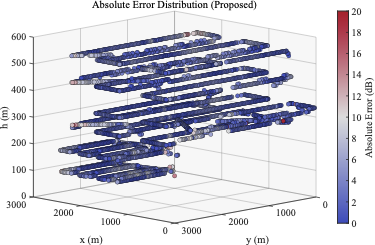

# Low-Altitude Communication Network Dataset

This repository hosts our **Low-Altitude Communication Network Dataset**, collected through real-world drone flight campaigns. The dataset is designed to support research in **low-altitude wireless coverage analysis, 5G NR network optimization, and UAV communication systems**. We will continue to expand the dataset with large-scale real-world low-altitude measurement campaigns in the future.

---

## Key Features

- **Before/After Optimization Pairs**: Measurements collected under both baseline and optimized base station configurations, enabling direct performance comparison and optimization evaluation.
- **Multi-Altitude Coverage**: Flight data captured at **four altitude levels** (approximately 75 m, 230 m, 400 m, and 500 m AGL), supporting 3D Radio characterization across the low-altitude airspace.
- **5G NR Signal Metrics**: Each measurement point includes **RSRP** and **SINR** for the serving cell and detected cells, providing rich link-quality information.
- **Base Station Configuration**: Accompanying BS deployment data including locations, antenna positions, azimuths, mechanical/electrical tilt angles.
- **Privacy-Preserving**: All absolute GPS coordinates are converted to **relative local coordinates**, and physical cell identifiers (PCIs) are anonymized via sequential integer remapping.


---

## Dataset Structure

```
dataset/
├── Before  # Measurement data — baseline configuration
├── After   # Measurement data — optimized configuration
└── Base Station.csv         # Base station deployment configuration
```

---

## Data Description

### Measurement Files (`Before` / `After`)

Each row corresponds to one measurement point collected by the UAV.

| Column | Unit | Description |
|---|---|---|
| `x(m)` | m | Local east coordinate (transverse Mercator projection) |
| `y(m)` | m | Local north coordinate (transverse Mercator projection) |
| `z(m)` | m | Flight altitude above ground |
| `Serving_PCI` | — | Anonymized serving cell identifier |
| `Serving_RSRP(dBm)` | dBm | SS-RSRP of the serving cell |
| `Serving_SINR(dB)` | dB | SS-SINR of the serving cell |
| `Detected_PCI` | — | Anonymized PCI(s) of intra-frequency detected cells (`;`-separated) |
| `Detected_RSRP(dBm)` | dBm | SS-RSRP of detected cells (`;`-separated) |
| `Detected_SINR(dB)` | dB | SS-SINR of detected cells (`;`-separated) |


### Base Station Configuration (`Base Station.csv`)

| Column | Unit | Description |
|---|---|---|
| `PCI` | — | Anonymized physical cell identifier |
| `x(m)` | m | Antenna east coordinate (local frame) |
| `y(m)` | m | Antenna north coordinate (local frame) |
| `z(m)` | m | Antenna mounting height |
| `Azimuth(deg)_before` | ° |Original antenna azimuth angle |
| `Downtilt(deg)_before` | ° |Original antenna downtilt angle |
| `Azimuth(deg)_after` | ° |Optimized antenna azimuth angle |
| `Downtilt(deg)_after` | ° |Optimized antenna downtilt angle |

---

## Measurement Campaign

| Parameter | Details |
|---|---|
| Frequency band| 5G n79 - 4.9GHz|
| Altitude levels | 75 m, 230 m, 400 m, 500 m|
| Coordinate system | Transverse Mercator, local origin fixed at reference BS |
| Positioning | UAV-RTK |

---

## Application Example

<p align="center">
  
</p>
<p align="center">
  <em>Example application of the dataset: 3D spatial distribution of absolute prediction error (dB) between radio simulation (using the provided base station configuration) and the field measurements collected by UAV across four altitude levels.</em>
</p>

---

## Citation

Please acknowledge the following paper if the dataset is useful for your research:

```bibtex
@article{huang2026building,
  title   = {Building Low-Altitude Communication Networks: A Digital Twin-Based Optimization Framework},
  author  = {Huang, Boqun and Wang, Yancheng and Guo, Wei and Guo, Zhaojie and Wu, Di and Li, Ran and Liu, Dayang and Lan, Wanshun and Huang, Chuan and Cui, Shuguang},
  journal = {arXiv preprint arXiv:2604.17781},
  year    = {2026}
}
```

